# Phase 3 — Database Design Theory Notes

## Learning Approach

For this phase, I am taking a **book-first approach**, where I work through books focused on database design and database theory. I want this section to be more structured than the earlier phases, because I have noticed that when I learn one topic here and another topic there, I can understand pieces of it, but I do not always build that deeper understanding of how everything connects.

Phase 3 is a little different from the previous phases because this phase is much more focused on the **theory behind databases** and the **technical understanding of what is going on under the hood**. In the previous phases, I was mostly working with SQL and already modeled data. Here, I want to better understand **why databases are structured the way they are**, what makes a design good or bad, and how that structure affects the accuracy and usefulness of data.

These notes assume that I already have:

* coding experience
* SQL experience

So this is not me starting from zero. This is me trying to build a more solid and organized understanding of database design so I am not just writing queries against databases other people designed, but actually understanding how and why the structure exists in the first place.

---

# Types of Database Problems

Most problems that surface in a database typically fall into two categories:

1. **Application utilization problems**
2. **Data problems**

Understanding the difference matters because not every problem that shows up around a database is actually caused by the database design itself.

---

## Application Utilization Problems

Application utilization problems usually come from the **front end**, or from the way users interact with the database through an application.

Examples include:

* problematic data-entry or data-edit forms
* confusing menus and toolbars
* confusing dialog boxes
* tedious task sequences
* poorly designed workflows

These types of issues often happen when the database developer or application developer:

* is inexperienced
* is unfamiliar with proper design methodology
* does not fully understand the software being used
* does not fully understand the data the system is supposed to handle

### My Understanding

So pretty much, if we use a **bank app** as an example, the issue may not be that the database itself is broken. The issue may be that the app is confusing, so the user does not know how to correctly enter or retrieve information. That confusion can mess up the process of moving data from the application into the database, or from the database back into the application for the user.

This same issue could happen with almost any system. The database might be structured fine, but if the application layer is poorly built, users are still going to have problems.

These problems matter, but they are outside the main scope of database design theory.

---

## Data Problems

Data problems are different because these are usually rooted in the **design of the database itself**.

Examples include:

* missing data
* incorrect data
* mismatched data
* inaccurate information
* duplicate data
* inconsistent values

Poor database design is usually the root cause of these problems. A database cannot meet an organization’s information requirements if it is not structured properly.

That does not always mean the developer is bad. A lot of people, even experienced programmers, were never really taught formal database design methodology. Many people know how to use databases, but not necessarily how to design them well from the ground up.

### My Understanding

A simple example would be an **age column**. We know age should probably be stored as an integer because it is numerical data. But if someone is not thinking carefully about data design, they might just store it as text and move on. It works at first, but later that can create problems with validation, calculations, filtering, and consistency.

So data problems are really where design starts to matter in a serious way.

---

# Database Development Process

The database development process is usually broken into **three phases**.

In some cases, people combine logical design and physical implementation because there can be overlap. But in general, it makes more sense to separate them. Before you build a house, you want the structure and blueprint to be sound before you actually start building.

That same logic applies here.

---

## 1. Logical Design

The first phase is **logical design**.

This phase involves:

* determining and defining tables
* defining fields
* establishing primary keys
* establishing foreign keys
* establishing table relationships
* determining levels of data integrity

This phase is about deciding **how the data should be organized** before anything is actually built in the DBMS.

The logical design is the priority for this section because I want to understand the structure first. This is really the “blueprint” phase of the database.

This will also be one of the first major idea sets I work through in the Phase 3 SQL practice notes.

---

## 2. Physical Implementation

The second phase is **physical implementation**.

This phase involves:

* creating the actual tables
* establishing key fields
* creating the relationships
* implementing data integrity using the tools the DBMS provides

So this is where the design gets turned into something real inside the RDBMS.

This part is more about implementation than theory, which is why I will cover more of this in **Phase 4 practice**.

---

## 3. Application Development

The third phase is **application development**.

This phase involves creating an application that lets a single user or a group of users interact with the data stored in the database.

That can include:

* entering data
* editing data
* retrieving data
* generating reports
* navigating the system

This phase can also be broken down further into smaller processes like:

* determining end-user tasks
* determining the order of those tasks
* determining report requirements
* creating menus and navigation systems

### My Understanding

This will usually fall more under front-end development. For me, the main concern right now is understanding how to organize data well enough that analysis becomes easier and I do not have to constantly clean bad data later.

---

# What Is a Database?

At the simplest level, as long as you are gathering data into a location for a specific reason, you have a database.

That definition is broad, but it helps make the point that a database is really about **organized data collected for a purpose**.

For the sake of these notes, I am assuming that the data has already been collected for us. Data collection is its own topic, and I am not focusing on that here.

---

# Types of Databases

There are two major types of databases in database management:

* **operational databases**
* **analytical databases**

---

## Operational Databases (OLTP)

Operational databases are **OLTP databases**, which stands for **Online Transaction Processing**.

These are databases used in environments where the data is dynamic and constantly changing.

### Example

A retail store is a good example. Data is constantly entering and leaving the database:

* purchases happen
* returns happen
* inventory changes
* customer records update

The database must handle lots of small, fast transactions.

---

## Analytical Databases (OLAP)

Analytical databases are **OLAP databases**, which stands for **Online Analytical Processing**.

These are designed more for analysis than for day-to-day transactions.

The data is often more static, meaning it does not change in the same constant way as an OLTP system.

### Example

This could be something like a geologist storing information about rocks or survey results. That data may not be changing constantly minute by minute. Instead, the goal is to analyze it.

---

## Connection Between the Two

Operational databases are often the original source for analytical databases.

So in many real-world systems:

* the OLTP database collects live business data
* that data later gets moved into an OLAP system for analysis

For my notes, I am mainly focusing on **operational databases**, because understanding those helps build the foundation for everything else.

---

# What Is a Relational Database?

A relational database stores data in **relations**, which we see as **tables**.

One thing I found interesting is that the term *relational* does not actually come from the idea of tables being related to one another, which is what I originally assumed. The name comes from the mathematical term **relation**, which comes from **set theory**.

That is actually pretty cool because it shows that the relational model is based on a real theoretical foundation, not just on the practical idea of connecting tables.

---

## Structure of a Relational Database

Each table, which is a relation, contains:

* **tuples** — these are the records or rows
* **attributes** — these are the fields or columns

Two important characteristics of a relational database are:

1. the physical order of the records or fields in a table does not matter
2. each record is identified by a field containing a unique value

Because of these characteristics, data in a relational database exists independently of the way it is physically stored on the machine. That means a user does not need to know where a record is physically located in order to retrieve it.

That separation is one of the powerful parts of the relational model.

---

# Relationships in the Relational Model

The relational model allows us to connect tables through relationships.

The main types are:

* one-to-one
* one-to-many
* many-to-many

These relationships are one of the main things that make relational databases powerful because they allow us to avoid redundant data and organize information cleanly.

I will keep working through examples of these in practice, because this is one of those ideas that becomes much clearer once you actually see it in tables.

---

# How We Retrieve Data

We retrieve data from relational databases using **SQL**, or **Structured Query Language**.

At this point, I have already covered SQL in detail in the previous phases and will continue to build on it, but now I want to connect SQL back to the design theory behind the database itself.

So rather than just learning how to query, I want to understand **why the query works the way it does based on the structure of the data**.

---

# Advantages of Relational Databases

## Built-In Multilevel Integrity

Relational databases support integrity at multiple levels.

* field level
* table level
* relationship level

That means the system can enforce rules about what values belong in a field, what makes a record unique, and how tables are allowed to connect to one another.

---

## Logical and Physical Data Independence

The logical and physical structure of the data is separate from the front-end application using it.

So if we go back to the bank app example, the database structure exists independently of the application interface the customer sees.

That separation is important because it allows the database to remain organized and stable even if the application changes.

---

## Guaranteed Data Consistency and Accuracy

Because relational databases enforce multiple integrity levels, they help keep data more consistent and accurate.

That is the goal. If your data is not accurate, then the information you generate from it becomes much less trustworthy.

---

## Easy Data Retrieval

Relational databases are easy to query because SQL gives us a structured way to retrieve information.

If the database is designed properly, this makes retrieval much easier and much more reliable.

---

# What Is a Relational Database Management System?

A **Relational Database Management System (RDBMS)** is the software application you use with a relational database.

The relational model itself is really just a way of organizing data. The RDBMS is the system that lets you actually implement, store, manage, and query that data.

Examples would be things like PostgreSQL, MySQL, SQL Server, and Oracle.

So in simple terms:

* the **relational model** is the design concept
* the **RDBMS** is the software that helps you use it

---

# Why Database Design Matters

There are many reasons to care about database design, but at the center of it all is this:

Good database design is crucial for **consistency, integrity, and accuracy**.

Inaccurate information is probably one of the worst outcomes you can get from a system. If the data is inaccurate, then what is the point of having it? Bad information leads to bad decisions.

Logical database design describes the size, shape, and needed systems of the database. It also supports both operational and informational needs.

That means logical design helps answer questions like:

* what records do we need to run day-to-day operations?
* what records do we need later for reporting and analytics?
* how should this data be structured so it stays useful over time?

Then once that logical design is sound, we build it physically inside the RDBMS.

---

# The Importance of Theory

Theory matters because theory gives us the basis for why the relational model works the way it does.

For example, when we join two tables together and retrieve matching data, that process has predictable behavior because of the rules and theory behind the relational model.

Relational databases are based on two branches of mathematics:

* **set theory**
* **first-order predicate logic**

We may not always need to do the math itself, but it is important to understand that the model is based on real logical principles. That helps explain why relational systems behave so predictably when designed correctly.

---

# The Advantage of Learning a Good Design Methodology

There are several advantages to learning and using a proper design methodology.

## It gives you the skills to design a sound database structure

If you just dump everything into one Excel file, you can run into all kinds of issues with duplication, inconsistency, and maintenance. A good methodology helps you avoid that by structuring data properly.

## It provides an organized set of techniques

Instead of randomly throwing data together, you have a process that guides you step by step.

## It reduces mistakes and unnecessary redesign

When you have structure, you are less likely to make careless design decisions that later force you to redo major parts of the database.

## It saves time

Good process reduces wasted effort. You spend less time guessing and more time designing with intention.

## It helps you use the RDBMS more effectively

If you understand how your data is modeled, then when you query a PostgreSQL database like dvdrental, you are better able to understand how to retrieve meaningful data from it.

---

# Objectives of Good Design

When designing a database, there should be clear objectives.

## The database supports both required and ad hoc retrieval

The database should support the information the business knows it needs, but it should also make it possible to answer unexpected questions later.

## Tables are constructed properly and efficiently

Each table should focus on one subject and contain distinct fields. This helps reduce redundancy and confusion.

## Data integrity is imposed at multiple levels

Integrity should exist at the field, table, and relationship levels.

## The database supports business rules

The database should reflect the way the organization actually works and the restrictions that matter to it.

## The database supports future growth

A well-designed database should be flexible enough to grow as business needs grow.

---

# Benefits of Good Design

## Easy to modify and maintain

Changes to one table or field should not unnecessarily break everything else.

## Data is easier to modify

When data is organized properly, updates are cleaner and safer.

## Information is easier to retrieve

A well-designed database makes querying easier because the relationships and structures are clear.

## End-user applications are easier to build

If the back end is designed well, front-end development becomes easier because the data is already organized in a logical way.

---

# Database Design Methods

Methods of database design generally include three major parts:

* requirements analysis
* data modeling
* normalization

---

## Requirements Analysis

This is where you talk to the people who will use the system and determine what the organization actually needs from the database.

This phase is about understanding the purpose of the system before you begin modeling anything.

---

## Data Modeling

This is where you actually model the database structure.

Examples of modeling approaches include:

* entity-relationship modeling
* semantic-object modeling
* object-role modeling
* UML modeling

This is also where you determine what fields belong in what tables.

---

## Normalization

Normalization is the process of reviewing tables against a set of rules so you can reduce redundancy, avoid duplicate data, and prevent problems when inserting, updating, or deleting records.

The database is tested against the normal forms and adjusted when problems are found.

Some of the normal forms include:

* First Normal Form
* Second Normal Form
* Third Normal Form
* Fourth Normal Form
* Fifth Normal Form
* Sixth Normal Form
* Boyce-Codd Normal Form
* Domain/Key Normal Form

The process itself should not be hard to understand if it is presented in a straightforward way.

---

# Normalization

Normalization is the idea of taking the tables you have created and testing them against rules that help improve the structure.

The main goal is to reduce redundancy and make sure the data is stored in a way that avoids unnecessary problems later.

This is one of the biggest parts of database design because even if your tables seem fine at first glance, normalization helps reveal structural issues that may not be obvious immediately.

---

# Why Terminology Matters

Like anything else, understanding the terminology matters because the language helps make the ideas clearer.

## These terms express the ideas of the relational model

A lot of the terminology is tied directly to set theory and predicate logic, which form the basis of the relational model.

## These terms help explain the design process

Once you understand the terms, the process of designing a database becomes much easier to follow.

## These terms appear everywhere

You will see them in books, software documentation, online resources, manuals, and course materials. So learning them is necessary if you want to seriously understand databases.

---

# Value-Related Terms

## Data

Data is the raw value stored in a database. It is static unless someone or something changes it.

Example:

* Sebastian Saverino
* 83488
* 05/16/2030
* 79

That by itself is just data.

---

## Information

Information is what you get when data is processed into something meaningful.

Without data, you cannot have information.

A simple way to think about it is:

* **data is what you store**
* **information is what you retrieve**

---

## Null

Null means a value is missing or unknown.

It does **not** mean zero, because zero is still a real value.

### How Null Can Appear

**Missing value**
This often happens because of human error, like forgetting to enter a last name.

**Unknown value**
This happens when the value truly is not known yet, such as someone not yet knowing their updated address.

Using a value like `N/A` can sometimes be better than relying too heavily on Null, because Null should not become a lazy catch-all.

### Why Null Matters

Null can affect calculations heavily.

Examples:

* `(Null × 3) + 4 = Null`
* `(25 × Null) + 4 = Null`
* `(25 × 3) + Null = Null`

So Null can greatly impact calculations and aggregate results, which is why it must be handled carefully.

---

# Structure-Related Terms

## Table

In a relational database, data is stored in relations, which we see as tables.

Each table should always represent a **single, specific subject**.

A table contains:

* records (rows)
* fields (columns)

The order of records and fields does not matter logically, and each table should have a field that uniquely identifies each record.

Tables can represent either:

* **objects**
* **events**

---

## Objects

An object is something tangible, like:

* a person
* a place
* a thing

Examples include:

* pilots
* products
* machines
* students
* buildings
* equipment

These all have characteristics that can be stored as data.

---

## Events

An event is something that occurs at a point in time and has characteristics worth recording.

Examples include:

* judicial hearings
* movie shoots
* elections
* geological surveys

So tables do not only represent things; they can also represent happenings.

---

## Data Tables

A data table stores the main working data of the system.

This data is dynamic because it can be inserted, modified, or deleted.

---

## Validation Tables

A validation table, or lookup table, stores values used to help enforce data integrity.

Examples might include:

* city names
* product codes
* project IDs
* skill categories

This type of data is usually much more static.

---

## Field

A field, also called an attribute, is the smallest structure in the database.

A field represents one characteristic of the subject the table describes.

Each field in a properly designed database should contain **one and only one value**.

### Poorly Designed Field Types

Improper designs often include:

* **multipart fields** — a single field containing multiple distinct pieces of data
* **multivalued fields** — a field containing multiple values of the same type
* **calculated fields** — fields storing values that should instead be calculated when needed

---

## Record

A record, or tuple, represents one unique instance of the subject of a table.

This is basically the row in your table.

Each record is identified through the primary key.

---

## View

A view is a **virtual table** made from one or more base tables.

A view does not store its own data. It simply displays data pulled from the underlying tables.

Views are useful because:

* they let you work with multiple tables together
* they can restrict what certain users see
* they can support integrity or reporting needs

---

## Index

An index is a structure provided by the RDBMS to improve data processing and query performance.

It is important to remember that an index is a **physical structure**, not part of the logical database design.

This matters because people often confuse indexes with keys, but they are not the same thing.

---

# Relationship-Related Terms

A relationship exists between two tables when records in one table can be associated with records in another.

Relationships are established through:

* primary keys and foreign keys
* or a linking table in the case of many-to-many relationships

Relationships are important because they:

* reduce redundant data
* help eliminate duplicate data
* support multitable queries
* support data integrity

---

## Types of Relationships

### One-to-One

A one-to-one relationship exists when one record in Table A is related to one and only one record in Table B.

One table acts as the parent and the other as the child.

---

### One-to-Many

A one-to-many relationship exists when one record in Table A can relate to many records in Table B, but each record in Table B relates back to only one record in Table A.

This is one of the most common relationship types.

---

### Many-to-Many

A many-to-many relationship exists when records in both tables can relate to many records in the other.

This type of relationship is implemented using a **linking table**.

That linking table usually contains the primary keys from both tables, and those keys serve as both:

* a composite primary key
* foreign keys back to the original tables

---

## Participation

Participation describes whether a table’s involvement in a relationship is mandatory or optional.

* **mandatory participation** means a related record must exist
* **optional participation** means it does not have to exist

This often depends on business rules and the nature of the data.

---

# Integrity-Related Terms

## Field Specification

A field specification, traditionally called a domain, includes all the elements that define a field.

These elements fall into three categories:

### General Elements

Basic identifying details such as:

* field name
* description
* parent table

### Physical Elements

How the field is built and represented, such as:

* data type
* length
* character support

### Logical Elements

Rules for the values themselves, such as:

* required value
* range of values
* null support

---

## Table-Level Integrity

Table-level integrity ensures:

* no duplicate records exist
* the primary key is unique
* the primary key is never Null

---

## Field-Level Integrity

Field-level integrity ensures:

* the structure of every field is sound
* values are valid
* values are consistent
* values are accurate
* similar fields are consistently defined across the database

---

## Relationship-Level Integrity

Relationship-level integrity ensures:

* table relationships are valid
* shared values remain synchronized
* inserts, updates, and deletes do not break the relationship

---

## Business Rules

Business rules are organizational restrictions placed on the database based on how the organization uses and understands its data.

These rules can affect:

* field values
* relationship participation
* allowed ranges
* update/delete behavior
* validation requirements

Because business rules directly affect integrity, they must be considered during design.

---

# Chapter 4 — The Design Process

This section covers the generalized phases of the database design process and what needs to be understood in each one.

---

# The Importance of Completing the Design Process

You should always follow the database design process from beginning to end, regardless of the specific design method you are using.

The goal is to have both:

* structural integrity
* data integrity

So if that is the goal, there is really no reason to skip steps.

Do not allow yourself to rely on shortcuts, because shortcuts in design usually lead to problems later.

---

# 1. Defining a Mission Statement and Mission Objectives

This is the first phase.

Before doing anything else, we need to understand what the database is supposed to do.

The **mission statement** defines the purpose of the database.

The **mission objectives** define the general tasks users should be able to perform with the data.

So the mission statement answers:

* why are we building this database?

And the mission objectives answer:

* what should this database allow users to do?

The main people involved in this phase are:

* the developer
* management or whoever is responsible for the system
* end users

---

# 2. Analyzing the Current Database

This phase is about understanding what already exists.

In many real-world cases, there is already some form of system in place, such as:

* a legacy database
* a paper-based system
* spreadsheets
* forms
* disconnected files

Understanding how data is currently collected and used helps guide the design of the new system.

This phase usually involves speaking with users and management to learn:

* how they interact with the current system
* what information they currently need
* what works
* what does not work

This process also helps create an initial field list.

You then refine that list by removing calculated fields and separating them out for later use.

Once refined, that field list becomes the starting point for designing the new database structure.

---

# 3. Creating the Data Structures

This is where the actual database structure begins to take shape.

This phase involves:

* defining tables
* assigning fields to tables
* establishing keys
* defining field specifications

You begin by identifying the subjects or events the tables should represent.

Then you assign fields from your earlier field list to the proper tables.

After that, you review the tables to ensure:

* each table represents only one subject or event
* there are no duplicate fields
* fields actually belong to that table
* fields are atomic and properly separated

You then define the primary keys and document field specifications for each field.

By the end of this phase, the tables should be structurally ready for relationship design.

---

# 4. Determining and Establishing Table Relationships

Now you determine how the tables relate to one another.

This phase involves:

* interviewing users and management again
* identifying relationships
* identifying relationship characteristics
* establishing relationship-level integrity

Users and management are helpful here because they understand how the data connects in the real world.

At this stage, you:

* identify the relationship type
* establish the connection using keys or linking tables
* define participation
* define degree of participation
* implement integrity behavior

What you use depends on the kind of relationship you are creating.

---

# 5. Determining and Defining Business Rules

This is the fifth phase.

Here you continue interviewing users and management to identify constraints the organization places on the data.

These rules can affect:

* fields
* records
* relationships
* validation behavior

Examples include:

* a ship date must occur after an order date
* a daytime phone number is required
* an agent may represent no more than 20 entertainers
* certain information must be updated yearly

You document these as business rules and implement them where necessary.

You may also create validation tables to support business rules when a field should only contain values from a specific list.

Business rules are an ongoing part of the process because organizations change, and those rules may evolve over time.

---

# 6. Determining and Defining Views

This phase focuses on views.

Different groups of users need to access the data in different ways, so views help tailor access and presentation to what specific users need.

This phase involves:

* interviewing users
* identifying useful data perspectives
* defining the views
* establishing criteria for retrieving specific information

Views help make the database more usable without changing the underlying tables.

---

# 7. Reviewing Data Integrity

This is the final review phase.

At this point, you go back through the design and confirm integrity at all levels.

## Table Review

You check that every table is properly structured and that table-level integrity exists.

## Field Review

You review field specifications and ensure field-level integrity is properly enforced.

## Relationship Review

You verify that relationships are valid and that inserts, updates, and deletes do not create problems.

## Business Rule Review

You confirm the business rules already identified and add any new ones that have surfaced during the process.

This phase is important because it acts as the final check before the design is considered sound.

---

# Chapter 5

Database design you start by defining the end result funny enough.

We want to define the purpose and the functions of your database

# Conducting Interviews

Interviews are important as they are the link between us the dev and the people you're creating the database for. Understanding things such as relationships, tables, and so on can be better clarified through interviews with the users.

It is important to have guidelines for your interviews:
    Make the participants aware of your intentions, let the people want to be apart of the interview
    Let the participant know there input is valuable to the overall design process
    Have everyone understand your the main arbitrator if and when a dispute arises.

For us as the interviewer:
    Choose an appropriate place to hold your meeting
    Be reasonable with the amount of people within the meeting
    Conduct separate meetings for users and management
    Prepare your questions prior to the interview.
    If you don't take good notes, either assign that task to a dependable transcriber for each interview or inform them you will record the call for reference purposes
    Give everyone our undivided attention
    Keep the pace of the interview moving
    Always maintain control of the interview

# Defining the Mission Statement 

The mission statement is the purpose of the database as we have learned about previously.
This brings the focus on what you're doing so you don't find yourself going over track

A good mission statement is to the point and succinct

this is an example of a good mission statement: The purpose of the New Starz Talent Agency database is to maintain the data we generate and to supply information that supports the engagement services we provide to our clients and the management services we provide to our entertainers.

A good mission statement is free of phrases or sentences that explicitly describe specific tasks.

Bad mission statement: The purpose of the Whatcom County Hearing Examiner’s database is to keep track of applications for land use, maintain data on applicants, keep a record of all hearings, keep a record of all decisions, keep a record of all appeals, maintain data on department employees, and maintain data for general office use.

Composing the mission statement: You want to interview the owner or manager of the organization to learn about the needs and also the organization as a whole as this can support the design process later as well. Ask open ended questions

How would you describe the purpose of your organization to a new client? What would you say is the purpose of your organization? What is the major function of your organization? How would you describe what your organization does? How would you define the single most important reason for the existence of your organization? What is the main focus of your organization?

These are some good questions for example you can ask.

# Defining the Mission Objectives

These are statements that will go over the specific tasks you want to be able to complete with your database. 

Mission objectives are very important when working further into the design process

A well-written mission objective is a declarative sentence that clearly defines a general task and is free from unnecessary details. It is expressed in general terms, succinct and to the point, and unambiguous. Here are some examples of typical mission objectives: Maintain complete patient address information. Keep track of all customer sales. Make sure an account representative is responsible for no more than 20 accounts at any given time. Keep track of vehicle maintenance. Produce employee phone directories.

Defining mission objectives is a process that involves conducting interviews with users and management and then writing appropriate mission objectives based on the information gathered from the interviews.

Once again we want to ask open ended questions. 

What kind of work do you perform on a daily basis? How would you define your job description? What kind of data do you work with? What types of reports do you generate? What types of things do you keep track of? What types of services does your organization provide? How would you describe the type of work you do?

Here are some good questions to ask.

# Getting to Know the Current Database 
To determine where you should go, you must first understand where you are.

We must understand how the organization database is currently before we can move forward with the design process.

Understand how does the current database support the mission statement and mission objectives currently.

You want to be asking those more abstract questions in this level.

We can answer design related questions by looking into the current database before you create the next one for your company.
Paper-based: This is your file system storage so like each person has a folder dedicated to them.

Legacy database: This a database your company has been working with for quite some time now, so understanding that is important as this can provide a base for when your going through the design process.

Human knowledge bases: This is based on the memory of individuals within your company.

Keep this in mind when creating the next database and analyzing the current databases.

**Do not adopt the current database structure as the bassi for the new database structure.**

If the old database didn't have problems you wouldn't be making a new one, keep that in mind.

When analyzing through a paper or a legacy database remember work through the process patiently and methodically.

# Conducting the Analysis 
The three steps in this process are:
Reviewing the way the data is collected.
Reviewing the manner in which information is presented.
Conducting interviews with users and management.

# Looking at How Data Is Collected
We first start by reviewing all paper-based items. Figure out the types of documents the organization is using to record the data and then make a record of each. Make sure to store these examples so we can use them later.
For example, say you have a training record, look at how they're organized.

We then review the computer programs that are used to collect data as well, as this can provide information regarding how the company works with its data.
I see this like when you take a look a how to sign up for something, we can take that and have that be apart of the design process.
Save screen shots of these forms.

# Looking at How Information Is Presented 
Now we look at how is data presented, this can be through reports, web pages, or slide shows.

Looking through how the company uses its data, we can decipher where does data from a database go into the presentations and what doesn't.

Reaching out to the person who create these presentations can save a bunch of time.

# Conducting Interviews 
This is where we interview management and users on how they use the data.

They can provide more context on your previous analysis.

They can just tell you how the use data in the company.

They are important for defining the preliminary field and the table structures

Can help us define the future data needs

Interviewing is so so so important.

We want to look for a subject so a person place or thing with this we want to find the characteristics that are associated with the subject.

Client is a person and age, salary, payment method are characteristics of this client.

# Interviewing Users 

When interviewing users we want to focus on these four things.

The types of data users are currently using
How users are currently using their data
The collection of samples we assembled during the first two steps of the analysis.
The required information the users require on a daily basis.

Interviewing Management 
We're focused on these types of questions for these interviews.

The types of information managers currently receive.
The types of additional information the need to receive.
The types of information they foresee themselves needing
Their perception of the organization's overall information requirements.

Compiling a Complete List of Fields 

Now we have completed our analysis of the current database and the users/management of the company.
We can create our preliminary field list. This will represent the organizations fundamental data requirements and constitutes the core set of fields that you'll define in the database. 

We create this preliminary field in two steps.

We first review and refine those characteristics so the describers of our subjects. As we have spoken on previously a field is a characteristic so now we just write out all those characteristics then remove the duplicates
Say we have name three times this is where we break that down and associate it to its subject so we would have Employee name client name and contact name
See where we have product number product num and product # then use the best option so product number in this case

Step 2 is determine whether there are new characteristics in any of your samples. 

We then compare with the characteristics we have in our list already then add form there.

We must create a field that contains aggregated data then make that our calculated field list

# Chapter 7

## Defining the Preliminary Table List 
This is the phase where we establish the tables for the new database we're creating.

First we use our preliminary field list so all the characteristics rounded it up into a list for the fields, the second is about using the list of subjects we gathered through our interview process, and the third is using the mission objectives we defined at the beginning of the database design process.

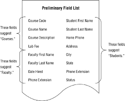

We look at our preliminary field list and spot the implied subjects.

We create a new preliminary field list that adds the subjects as well.

Remove duplicates first

Cross reference your two preliminary field lists

We then work to having just a single preliminary field list.

The last step is we reference our mission objectives to our field list to make sure we're not missing anything.

# Defining the Final Table List 

Now that our preliminary field list is complete we can make our final table list.

Here we have table types this can help classify a table by the role is plays in our database.

A data table: represents a subject that is important to the organization and is the primary foundation of the database.

Linking table: Establishes a link between two tables in a many-to-many relationship

Subset table: Contains fields that are related to a particular data table and further describes the data tables subject in a very specific manner

Validation table: Contains relatively static data and is crucial to data integrity.

We also have our table description of what each table does.

Guidelines for creating table names:

Create a unique, descriptive name that is meaningful to the entire org ex Vehicle Maintenance.

Create a name that accurately, clearly, and unambiguously identifies the subject of the table. Example Client Meetings vs Dates good vs bad

Use the minimum number of words necessary to convey the subject of the table. Equipment vs TD_1

Do not use words the convey physical characteristics.

Do not use acronyms or abbreviations

Do not use proper names or other words that will unduly restrict the data that can be entered into the table.

Do not use a name that implicitly or explicitly identifies more than one subject.

Do use the plural form of the name.

After we have done this write out a description of each table.

We will further more conduct more interviews with members of the organization to make sure the tables are properly defined.

# Associating Fields with Each Table 

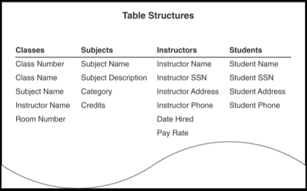

This image will show us how we map our subjects and associate our field names to each of them
# Refining the Fields 

Now we refine our field names.

Create a unique, descriptive names that is meaningful to the entire organization.

Create a name that accurately, clearly, and unambiguously identifies the characteristic a field represents.

Use the minimum number of words necessary to convey the characteristic of the field.

Do not use acronyms or abbreviations

Do not use words that could confuse the meaning of the field name.

use the singular form of the name. Skill vs skills

Using an ideal field to resolve anomalies.

It represents a distinct characteristic of the subject of the table. 

It contains only a single value.

A field that can possibly store two more occurrences of the same value is known as a multivalued field.

It cannot be deconstructed into smaller components. A field that can potentially store two or more distinct items within a value is know as a multipart or composite field.

It does not contain a calculated or concatenated value.

It is unique within teh entire database structure.

It retains a majority of its properties when it appears in more than one table. 

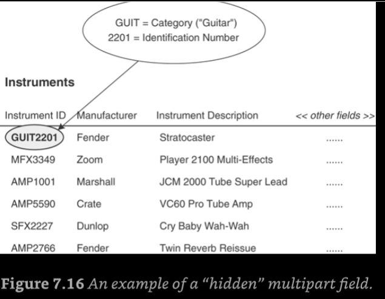

THis is the idea of a multipart field.

You want to break these apart and make them there own distinct fields

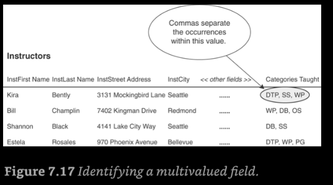

We can use the basis of the mulitvalued field and make it into its own table. 
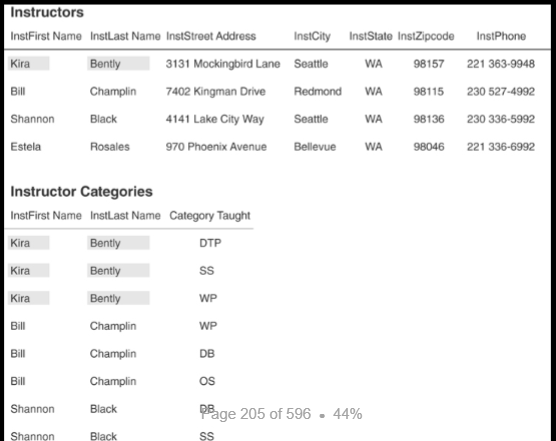

# Refining the Table Structures

A duplicate field is a field that appears in two or more tables for any of these reasons.
It is used to relate a set of tables together. 
It indicates multiple occurrences of a particular type of value. 
There is a perceived need for supplemental information. 
The only instance in which a duplicate field is necessary is when it serves to establish a relationship between

The elements of the Ideal Table constitute a set of guidelines you can to create sound table structures 

An ideal table has the following

Represents a single subject which can be an object or event

It has a primary key

It does not contain multipart or multivalued fields.

It does not contain calculated fields.
Does not contain unnecessary duplicate fields

It contains only an absolute minimum amount of redundant data.

When you see reference fields these can be easy to resolve, you just get rid of them lol, you don't need the company website associated with the instrument 

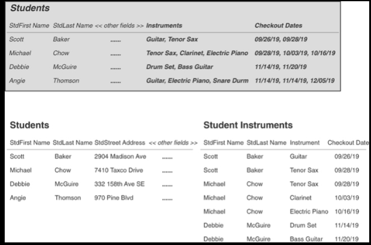

Establishing subset tables

This is the idea of having a table that has multiple fields that could have one but one will not

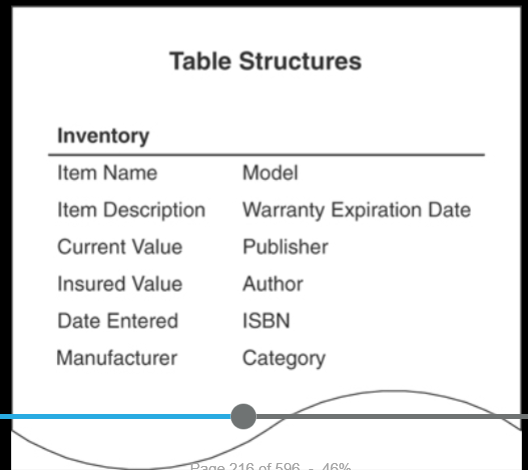

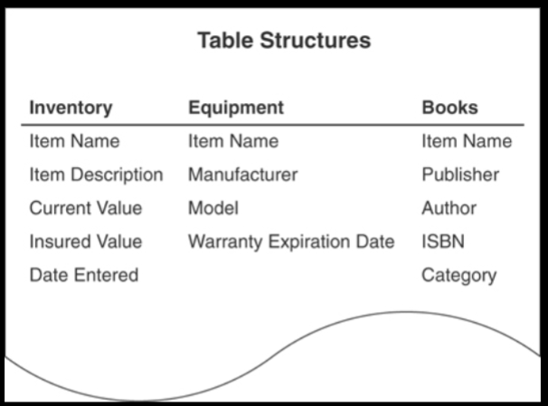

When you identify subset tables such as these, you can refine them using these steps. 
Remove all the fields that the subset tables have in common and use them as the basis for a new data table. 
Identify what subject the new data table represents, and then give that table an appropriate name. 
Make sure that the subset tables represent subordinate subjects of the data table and modify the subset table names as necessary. 
Compose a suitable description for the data table and then add it to the Final Table List. Indicate the table type as “Data.”

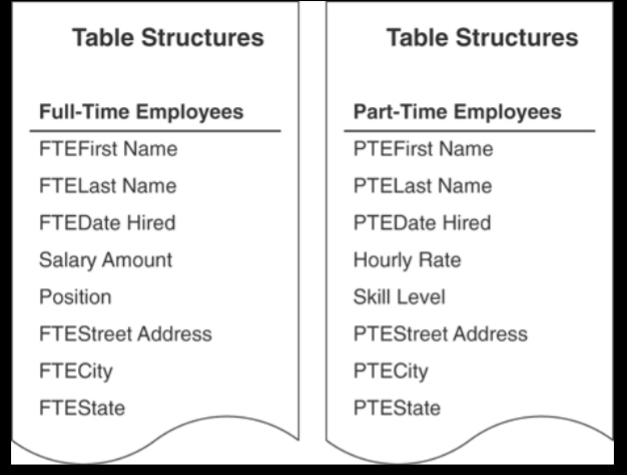

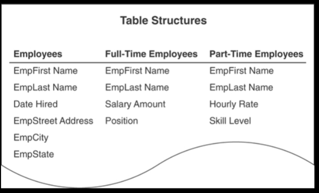

We can refine this further with foreign keys, relationships, and business rules.

# Chapter 8

## Why Keys Are Important 

Keys are important because of the following:

They ensure that each record in a table is precisely identified. 

They help establish and enforce various types of integrity.

They serve to establish table relationships.

### Establishing Keys for Each Table

Our four main keys are candidate, primary, foreign, and non-keys.

Candidate keys:
The first key we establish for a table is the candidate key, which is a field or set of fields that uniquely identifies a single instance ( a record in the table) of the table's subject. Each table must have at least one candidate key.

A candidate key cannot be a mutlipart field

must contain unique values

cannot contain null

value cannot cause a breach of the organizations security or privacy rules

Its value is not optional in whole or in part, must something

comprises a minimum number of fields necessary to define uniqueness

values must uniquely and exclusively identify each record in the table.

Its value must exclusively identify the value of each field within a given record.

Its value can be modified only in rare or extreme cases, the value of your candidate key should never change unless its an issue.

Say you have a table with no possible candidates for candidate keys you can create an artificial key or surrogate key
For example creating a part number field

What is an primary key?

A primary key field exclusively identifies the table throughout the database structure and helps establish relationships with other tables

A primary key value uniquely identifies a given record within a table and exclusively represents that record throughout the entire database.

A primary key is a candidate key but a candidate key is not a primary key hence the name.

Guidelines when choosing a proper primary key
If you have a simple (single-field) candidate key and a composite candidate key, choose the simple candidate key. It’s always best to use a candidate key that contains the least number of fields. 
Choose a candidate key that incorporates part of the table name within its own name. For example, a candidate key with a name such as SALES INVOICE NUMBER is a good choice for the SALES INVOICES table.
# Establishing Keys for Each Table 

Elements of a Primary Key 
It cannot be a multipart field. 
It must contain unique values. 
It cannot contain Nulls.
Its value cannot cause a breach of the organization’s security or privacy rules. 
Its value is not optional in whole or in part. 
It comprises a minimum number of fields necessary to define uniqueness. Its values must uniquely and exclusively identify each record in the table. 
Its value must exclusively identify the value of each field within a given record. 
Its value can be modified only in rare or extreme cases.

How do we create the primary key for each table in a database?

Each table must have one-and only one-primary key

Each primary key within the database must be unique-no two tables should have the same primary key unless they bear a one-to-one relationship or one of them is a subset table

Alternate keys:

Once we have designated our primary key we designate the remaining candidate keys will then become alternate keys

Non-keys:
This is a field that does not serve as a candidate,primary, alternate, or foreign key.

# Table-Level Integrity 

THis is important as it ensures the following

There are no duplicate records in a table.

The primary key exclusively identifies each record in a table.

Every primary key value is unique.

Primary key values are not null.

Reviewing the Initial Table Structures

Now we have identified our keys we now conduct more interviews

We want to do the following:

Ensure that the appropriate subjects are presented in the database. 

Make certain that the table names and table descriptions are suitable and meaningful to everyone.

Make certain that the field names are suitable and meaningful to everyone

Verify that all the apprppriate feidls are assigned to each table

# Chapter 9

## Why Field Specifications Are Important 

Fields are the bedrock of data integrity within your database.

Field specifications help establish and enforce field-level integrity.

Defining field specification for each field enhances overall data integrity.

Defining field specifications compels you to acquire a complete understanding of the nature and purpose of the data in the database.

Field specification constitute the "data dictionary" fo the database.

## Field-Level Integrity 

Field-level integrity is attained after you defined a complete set of field specifications for the field. Field-level integrity warrants the following.

    The identity and purpose of a field are clear, and all the tables in which it appears are properly identified.

    Field definitions are consistent throughout the database.

    The values of a field are consistent and valid.

    The types of modifications that can be applied to the values in the field are clearly identified.

## Anatomy of a Field Specification Using Unique, Generic, and Replica Field Specifications 

All the elements within the specification are categorized as general elements, physical elements, or logical elements.

General Elements: Field Name, Parent Table, Specification Type, Source Specification, Shared By, Alias(es), Description

Physical Elements: Data Type, Length, Decimal Places, Character Support

Logical Elements:  Key Type, Key Structure, Uniqueness, Null Support, Values Entered By, Required Value, Range of Values, Edit Rule

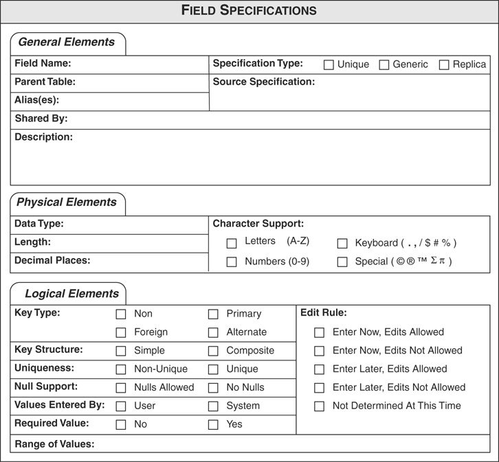

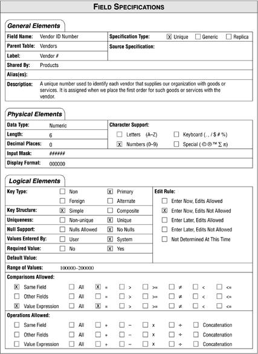

This is a rather simple concept of just filling in the blanks fo a Field specifications worksheet.

