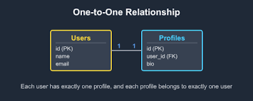
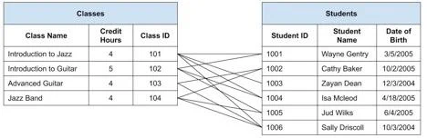
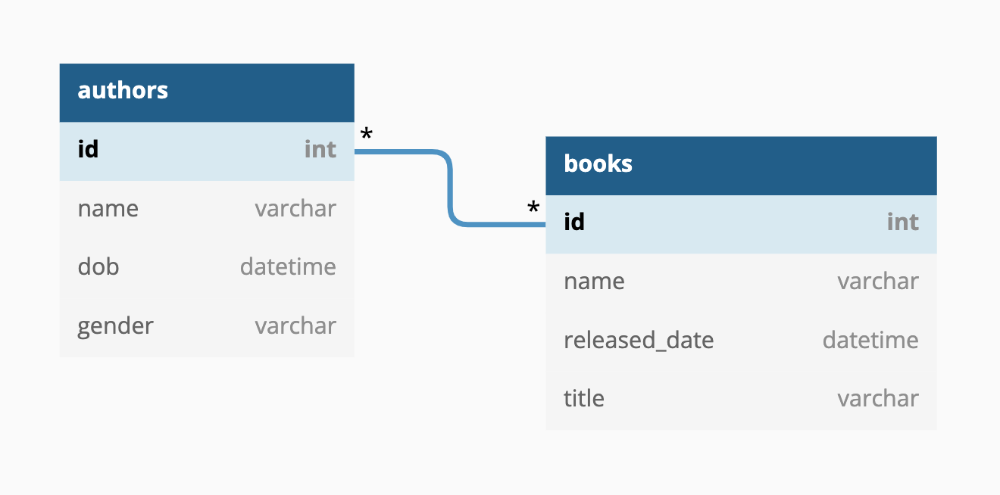

I'm going to take a book first approach, where I work through a book focused on whatever phase three topic we need.

For this first section, I'm going to walk through with this by reading through database books. 

Phase 3: Is a little bit different compared to our previous phases as this phase is more based on the theory behind databases and technical understand of what is going on, as we have been working with already modeled data.

For these notes it is assumed that I have coding experience which I do and SQL experience as well, this is a structured way of learning, as I find myself learning a topic there and then learning another topic somewhere else, then not getting the in depth knowledge of a topic.

Most problems that surface in a database fall into two categories: *application utilization* problems and *data* problems

Application problems include such things as problematic data entry/edit forms, confusing menus and toolbars, confusing dialog boxes, and tedious task sequences. These problems typically arise when the database developer is inexperienced, is unfamiliar with a good application design methodology, knows too little about the software he’s using to implement the database, or has an insufficient understanding of the data with which he is working. Problems of this nature are common and important to address, but they are beyond the scope of this work.

So pretty much, when we make a bank app for example and no one know hows to use properly make your bank data go to the database for the individual using the bank app to properly move into the data base, this same thing could apply for an application for an individual trying to maybe get data from the database with there being a front end application that is super confusing and can mess up that process of going from that application page to the database.

Data problems, on the other hand, include such things as missing data, incorrect data, mismatched data, and inaccurate information. Poor database design is typically the root cause of these types of problems. A database will not fulfill an organization’s information requirements if it is not structured properly. Although poor design is typically generated by a database developer who lacks knowledge of good database design principles, it shouldn’t necessarily reflect negatively on the developer. Many people, including experienced programmers and database developers, have had little or no instruction in any form of database design methodology. Many are unaware that design methodologies even exist. Data problems and poor design are the issues that this work will address.

Data problems is how we have an age column we know that this column should be assigned an integer as well it is a number buttt if you're not super great with the data design you just call it a string and call it a day.

Database development process has three phases. 

In some cases people may combine logical design and physical implementation together as they can have some overlap, but before you build a house you want the structure and the blueprint to be sound before you start building it.

**Logical design**: The first phase involves determining and defining tables and their fields, establishing primary and foreign keys, establishing table relationships, and determining and establishing the various levels of data integrity. 

The logical design will be the priorty for this section.

This will be the first examples we work through in the phase 3 sql practice md

**Physical implementation**: The second phase entails creating the tables, establishing key fields and table relationships, and using the proper tools to implement the various levels of data integrity. 

This will be covered as well within our phase 4 practice file.

**Application development**: The third phase involves creating an application that allows a single user or group of users to interact with the data stored in the database. The application development phase itself can be divided into separate processes, such as determining end-user tasks and their appropriate sequences, determining information requirements for report output, and creating a menu system for navigating the application.

This will typically fall under front end development as we're trying to understand how do we organize our data so we can gain that value through analysis without having to constantly clean our data and so on.

# What Is A Database?

As long as you're gathering data into a location for a specific reason, you have a database.

For the sake of these notes, we're assuming that the data is collected from somewhere for us already, this is another topic in itself.

There are two types of databases in database management: 

We got operational databases and analytical databases

Operational databases are OLTP or Online Transactional processing databases. These are going to be used where data is dynamic so how you have a retail store that has data constantly leaving and entering your database every minute

Analytical databases are OLAP or Online Analytical Processing databases, this is where your data is static so typically does not change like you have in a retail store, this could be like a geologist to having a database of rocks that doesn't change.

Operational databases typically are the original datasource for an analytical database.

I'm going to focus on operational databases for my notes.

# What is a relational database?

Indeed, the name of the model itself is derived from the term relation, which is part of set theory. (A widely held misconception is that the relational model derives its name from the fact that tables within a relational database can be related to one another.)

I completely thought that relation was because of the idea of connecting different tables, so that is cool, so understanding that it came about because of the idea of set theory which is the theory behind.

A relational database stores data in relations, which we see as tables. [Schema](dvd_rental_schema.pdf). This schema for our beloved dvdrental database shows the tables within our database. 

Each of our tables (relations) have tuples, so static data, so this can be records, and attributes, or fields.

The physical order of the records or fields in a table is completely immaterial, and each record in the table is identified by a field that contains a unique value. These are the two characteristics of a relational database that allow the data to exist independently of the way it is physically stored in the computer. As such, a user isn’t required to know the physical location of a record in order to retrieve its data.

For our lovely relational model of data we use
one-to-one, 
one-to-many,
and
many-to-many
See practice for examples 

How do we retrieve data, that is through our wonderful structured query language which as this point I have covered in detail in the previous 2 phases and will continue to work with throughout this journey.

# What are the advantages of Relational Databases?

Built-in multilevel integrity:
We build data integrity at the field level so each piece of data should follow a set of rules set by the table, right there is two levels of data integrity then the relationships between the tables is also set as well.

Logical and physical data independence from database applications:
The logical and physical data part is separate from our front-end application such as our bank app when we add money to our account.

Guaranteed data consistency and accuracy:
Data is consistent and accurate because of the multiple levels of integrity that relational models bring.

Easy data retrieval:
I can get data from my database using sql making data retrieval easy.

# What is a Relational Database Management Systems

A relational database management system is a software application that you use with a relational database, because in reality, all a relationship model is, is a way of making sure our data is organized.

# Why Should You Be Concerned with Database Design? 

There are a plethora of reasons we should care about database design, it is crucial to consistency, integrity, and accuracy of the data in a database. Inaccurate data is probably the worst thing you can do with information, as what is the point if your data is inaccurate, what does it help now. Per book definition though: *Inaccurate information is probably the most detrimental result of improper database design—it can adversely affect your organization’s bottom line.*

The logical database design describes the size, shape, and necessary systems for our database, and it logical database design describes the size, shape and necessary systems for your database. Logical design is also for operational and informational needs, such as what records do we want to  save for analytics or what records we need so we can correctly work with the customer. 

We then build this within our lovely relational database management system, using SQL or whatever way you want to ingest your data. For the physical creations of our database

# The Importance of Theory 

Theory like in many other diciplines is a used to base how you want to go about a certain problem set for example:
You know that you can draw data from both tables simultaneously simply because of the way relational database theory works. The data you draw from both tables is based on matching values of a shared field between the tables themselves. Again, your actions have a predictable result.

The relational database is based on two branches of mathematics known as **set theory** and ,**first-order predicate logic**, so this is the basis of the theory relational database.
We might not always need to understand the mathematical logic behind the relational model but its important to understand the building blocks of the model.

# The Advantage of Learning a Good Design Methodology 

There are several advantages from learning and using a good designing methodolgy:

*it gives you the skills you need to design a sound database structure*: Say you hold all your data in excel, that brings about so many issues holding all your data in that one location so having that data organized using a database structure is important.

*Provides you with an organized set of techniques that will guide you step by step through the design process*: What step by step do you have when you just throw data into an excel? This way we have a reason to our why

*Helps you keep your missteps and design reiterations to a minimum*: Once again when we have structure we will find ourselves not having as many errors like when we are told do this with no instruction to do this but here is a instructions.

*Makes the design process easier and reduces and the amount of time you spend designing the database*: When you have a guide, you are less likely to actually to be lead astray and just waste time. 

*Will help you understand and use your RDMBS application program more fully and effectively*: If we can understand how our data is modeled such as when we query our postgres dvdrentals database we can better understand how to get information from it.

# Objectives of Good Design 

You should have actual objectives to achieve when you're making your database structure. 

*Database supports both required and ad hoc information retrieval*: You need your managers information so you know who is the manager when you pay someone but you also want customer data so you can better cater to the customers

*tables are constructed properly and efficiently*: Each table focuses on one subject with distinct fields, so we can avoid redundant data to a minimum.

*Data integrity is imposed at the field, table, and relationship levels*: The levels are integrity are important as we have hit on multiple times already

*Database support business rules relevant to the organization*: The data need to provide valid and accurate information

*Database lends itself to future growth*: The structure of a database is meant to be easy to modify and expand upon the information needs of your company.

# Benefits of Good Design 

*The database structure is easy to modify and maintain*: Modifications you make to a field, table, or relationship need not adversely affect other fields, tables, or relationships in the database.

*Data is easy to modify*: YOu can modify the data without it hurthing other data in the database

*Information is easy to retrieve*: Easy to query because you properly create the relationships between the databases.

*End-user application are easier to develop and build*: You can spend more time with the front end because you created the back end well.

# Database-Design Methods 

Methods of database design corporate three phases: requirements analysis, data modeling and normalization.

Requirement-analysis: You speak with the people that are going to be using it and as well what your company needs in regards to data

Data-modeling: This is how we actually model our database structure using a data-modeling method, such as the following entity-relationship (ER) diagramming, semantic-object modeling, object-role modeling, or UML modeling.

Fields are alos defined and associated with the correct tables such what data do we need for clients information?

Normalization: This ist he last part of our database design, this is the idea of how we have our data and using a set of rules to better trim down redundant data and duplicate data and avoid problems with inserting, updating, or deleting data. The tables are then tested against the normal forms and the modified if any of the problems are found.

The normal forms currently in use are First Normal Form, Second Normal Form, Third Normal Form, Fourth Normal Form, Fifth Normal Form, Sixth Normal Form, Boyce-Codd Normal Form, and Domain/Key Normal Form.

The process of designing a database is not and should not be hard to understand. As long as the process is presented in a straightforward way. 

# Normalization 

This is the idea of creating our tables then having those tables be put against a set of rules so in the case normalization. 

# Why This Terminology Is Important 

Like any thing, understanding the terms that are associated is very important.

*They are used to express the special ideas and concepts of the relation database model*: Much of the terms are correlated with set theory and first-predicate logic which as we have discussed make up the basis of our relational model

*They are used to express and define the database-design process itself*: The design process becomes clearer and much easier to understand after you know these terms.

*They are used anywhere a relational database or RDBMS is discussed*: You’ll see these terms in materials such as online software manuals, educational course materials, commercial database software books, and database-related websites.

The following titles are the four groups of terms we will discuss

# Value-Related Terms 
Data: These are the values you store in a database. Data is static unless someone modifies it through automation or manually
ex: Sebastian Saverino 83488 05/16/30 79

Information: This is data we make useful through processing, in order to get information we must process our data to gain something meaningful from it.

Without data you don't have information as you need to make data into information
Data is what you store; information is what you retrieve.

Null: this is a missing or unknown value, this does not mean Null is 0 as zero is an integer. 

How does Null appear?
Missing Values: this is commonly something to happen with human error. Say you ask for someones First name but forgot the last, now you have a Null value for the last name, its not that she doesn't have a last name its that you forgot, therfore human error.

Unknown Value: Say you add a new row, this row has all the data but unlike the other rows where they might have a secondary phone number this one does not therefore the cell is null then we have other circumstances like someone is moving so they don't know there current address yet.

Using a true value such as N/A can still make a difference as Null can be overused as a catch all.

Null is not great as any thing any math operation that uses Null will automatically become Null  (Null × 3) + 4 = Null (25 × Null) + 4 = Null (25 × 3) + Null = Null

Null effects your aggrgates greatly so be aware 

# Structure-Related Terms 

Table: Data stored in a relational database is stored as relations which is stored as tables with tuples(records so our individual rows) and attributes (fields)
Each table alwasy represents a single, specifc subject. The logical order of records and fields wihtin a tbale has no importanct, and every table has one field which is the primary key which makes each tables unique

In fact, data in a relational database can exist independently of the way it is physically stored in the computer because of these last two table characteristics. This is great news for the user because he or she isn’t required to know the physical location of a record in order to retrieve its data.

Tables can represent either an object or an event.

Object means the table represents something that is tangible, such as a person , place , or thing.No matter the type every object has characteristics that you can store as data and then process as information in an almost infinite number of ways. SO object data can be used to make intelligence answer from. 
Pilots, products, machines, students, buildings, and equipment are all examples of objects that a table can represent,

Events: This is something that occurs at a given point in time that has characteristics you would want to record. You store this data like you objects to gain that information but what makes up the data may be different for example events you may need to record include judicial hearings, movie shoots, elections, and geological surveys.

A table that stores data used to supply that information is called a data table and it is the most common type of table in a relation database. This data is dynamic because we can modify, delete and so on with it.

A validation table also known as a lookup table is something that stores data that you specifically use to implement data integrity.  A validation table usually represents subjects, such as city names, skill categories, product codes, and project identification numbers. Data in this type of table is static because it will very rarely change at all.

A field or known as a attirbute in relation database theory is the smallest structure int eh database, and it represents a characterist of the subject of the table to which it belongs. Fields are the structures that actually store datra. 

Every field in a properly designed database contains one and only one value, and its name will identify the type of value it holds.

You’ll typically encounter three other types of fields in an improperly or poorly designed database. 
A multipart field (also known as a composite field), which contains two or more distinct items within its value.
A multivalued field, which contains multiple instances of the same type of value. 
A calculated field, which contains a concatenated text value or the result of a mathematical expression. 

A record (known as a tuple in relational database theory) this represents a unique instance of the subject of  a table record is identified throughout the database by a unique value in the primary key field of that record. This is like the row for your data 

A view is a “virtual” table composed of fields from one or more tables in the database; the tables that comprise the view are known as base tables. The relational model refers to a view as being “virtual” because it draws data from base tables rather than storing data on its own. In fact, the only information about a view that is stored in the database is its structure. Many major RDBMS programs support views and typically refer to them as saved queries.

They enable you to work with data from multiple tables simultaneously. (For a view to do this, the tables must have connections, or relationships, to each other.) 
They enable you to prevent certain users from viewing or manipulating specific fields within a table or group of tables. This capability can be very advantageous in terms of security. 
You can use them to implement data integrity. A view you use for this purpose is known as a validation view.

An index is a structure an RDBMS provides to improve data processing. Your particular RDBMS program will determine how the index works and how you use it. However, an index has absolutely nothing to do with the logical database structure! The only reason I include the term index in this chapter is that people often confuse it with the term key.

indexes are physical structures you use to optimize data processing.

# Relationship-Related Terms 

A relationship exists between two tables when you can in some way associate the records of the first table with those of the second. You can establish the relationship via a set of primary and foreign keys (as you learned in the previous section) or through a third table known as a linking table (also known as an associative table).

A relationship is an important component of a relational database. It enables you to create multitable views. It is crucial to data integrity because it helps reduce redundant data and eliminate duplicate data. You can characterize every relationship in three ways: by the type of relationship that exists between the tables, the manner in which each table participates, and the degree to which each table participates. 
Types of Relationships 
Three specific types of relationship (traditionally known as a cardinality) can exist between a pair of tables: one-to-one, one-to-many, and many-to-many.

one-to-one: when a single record in the first table is related to zero or one and only one record in the second table, and a single record in the second table is related to one and only one record in the first table. In this type of relationship, one table serves as a “parent” table and the other serves as a “child” table. You establish the relationship by taking a copy of the parent table’s primary key and incorporating it within the structure of the child table, where it becomes a foreign key.

one-to-many: A one-to-many relationship exists between a pair of tables when a single record in the first table can be related to zero, one, or many records in the second table, but a single record in the second table can be related to only one record in the first table. The parent/child model I used to describe a one-to-one relationship works here as well. In this case, the table on the “one” side of the relationship is the parent table, and the table on the “many” side is the child table. You establish a one-to-many relationship by taking a copy of the parent table’s primary key and incorporating it within the structure of the child table, where it becomes a foreign key.

many-to-many: A pair of tables bears a many-to-many relationship when a single record in the first table can be related to zero, one, or many records in the second table and likewise a single record in the second table can be related to zero, one, or many records in the first table. You establish this relationship with a linking table. (You learned a little bit about this type of table at the beginning of this section.) A linking table makes it easy for you to associate records from one table with those of the other and will help to ensure you have no problems adding, deleting, or modifying related data. You define a linking table by taking copies of the primary key of each table in the relationship and using them to form the structure of the new table. These fields actually serve two distinct roles: Together, they form the composite primary key of the linking table; separately, they each serve as a foreign key.

Types of Participation:

A table’s participation within a relationship can be either mandatory or optional. Say a relationship exists between two tables called TABLE_A and TABLE_B. TABLE_A’s participation is mandatory if you must enter at least one record into TABLE_A before you can enter records into TABLE_B. 
TABLE_A’s participation is optional if you are not required to enter any records into TABLE_A before you can enter records into TABLE_B. 

# Integrity-Related Terms

A field specification (traditionally known as a domain) represents all the elements of a field. Each field specification incorporates three types of elements: general, physical, and logical.

General elements constitute the most fundamental information about the field and include items such as Field Name, Description, and Parent Table. 
Physical elements determine how a field is built and how it is represented to the person using it. This category includes items such as Data Type, Length, and Character Support. 
Logical elements describe the values stored in a field and include items such as Required Value, Range of Values, and Null Support. 

Table-level integrity (traditionally known as entity integrity) ensures that no duplicate records exist within the table and that the field that identifies each record within the table is unique and never Null. 
Field-level integrity (traditionally known as domain integrity) ensures that the structure of every field is sound; that the values in each field are valid, consistent, and accurate; and that fields of the same type (such as CITY fields) are consistently defined throughout the database. 
Relationship-level integrity (traditionally known as referential integrity) ensures that the relationship between a pair of tables is sound and that the records in the tables are synchronized whenever data is entered into, updated in, or deleted from either table.
Business rules impose restrictions or limitations on certain aspects of a database based on the ways an organization perceives and uses its data. These restrictions can affect aspects of database design, such as the range and types of values stored in a field, the type of participation and the degree of participation of each table within a relationship, and the type of synchronization used for relationship-level integrity in certain relationships. All of these restrictions are discussed in more detail in Chapter 11. Because business rules affect integrity, they must be considered along with the other three types of data integrity during the design process. 