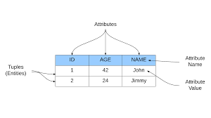
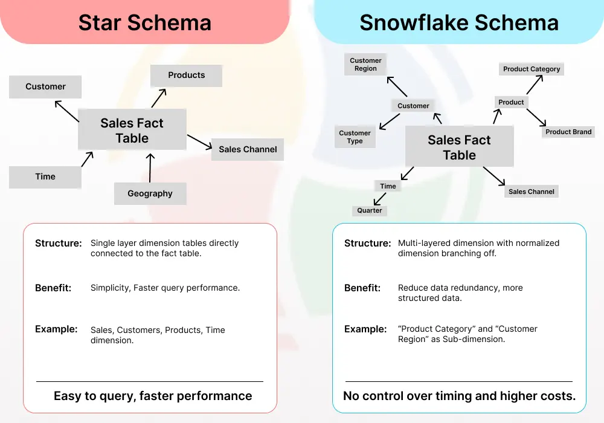

# Data Warehousing Toolkit Notes

For this section of notes, I will be reading *The Data Warehousing Toolkit*.

This will be slightly different from my previous notes, as some parts of this book are outdated. Because of that, the depth of notes per chapter may vary depending on relevance.

The goal here is not to capture everything, but to focus on what is still useful and applicable to modern data work.

---

## How I’m Approaching This Book

I am primarily looking for:
- core concepts that still apply today  
- patterns that show up in real-world systems  
- terminology that I should understand  
- ideas that expand how I think about data modeling  

One thing to keep in mind:

Modern data analytics does not always follow a strict, upfront modeling process with stakeholders like Kimball describes. With modern tooling, it’s much easier to iterate and remodel later.

So instead of:
> design everything upfront

It is often:
> start simple → refine as usage grows

---

## Key Areas of Focus

### 1. Kimball’s Four-Step Dimensional Modeling Process

This is the foundation.

I want to understand:
- how Kimball approaches modeling step-by-step  
- how this compares to modern workflows  
- where this is still useful vs where it is less practical today  

---

### 2. Fact Tables (Core Concept)

Focus areas:
- the three main types of fact tables  
- the fourth (less common) type  

Goal:
Understand when and why each type is used.

---

### 3. Dimension Tables

Key concepts to focus on:
- degenerate dimensions  
- multiple hierarchies  

Keys (important):
- surrogate keys  
- natural keys  
- durable keys  
- “supernatural” keys  

Goal:
Understand how dimensions are structured and identified.

---

### 4. Integration via Conformed Dimensions

Focus areas:
- Enterprise Data Warehouse Bus Architecture  
- Bus Matrix  
- Opportunity / Stakeholder Matrix  

Note:
This is more historical and not commonly used today due to modern cloud data warehouses.

Still useful because:
- it shows how systems were designed at scale  
- it builds appreciation for how far tooling has come  

---

### 5. Slowly Changing Dimensions (Very Important)

Read all of this.

This is still highly relevant.

Also worth understanding:
- how SCDs are handled in modern systems  
- how cloud warehouses may simplify or change implementation  

---

### 6. Dimension Hierarchies

Go through all of this.

Main takeaway:
Some business scenarios create complex or non-standard hierarchies.

Example:
- employees managing each other in different contexts  

Goal:
Expand understanding of edge cases and modeling flexibility.

---

### 7. Advanced Fact Table Techniques

Skim:
- multiple currency facts  
- timespan tracking  

Focus:
- late arriving facts (important and common pattern)

---

### 8. Advanced Dimension Techniques

Focus areas:
- audit dimensions (data quality related, still very relevant)  
- late arriving dimensions  

Goal:
Understand how to handle imperfect or delayed data.

---

### 9. Special Purpose Schemas

Key concept:
- error event schemas  

This ties into:
- data quality  
- tracking failures or anomalies  

Still very applicable in modern systems.

---

## Overall Goal

The goal is not to follow Kimball exactly, but to:

- understand how dimensional modeling is *supposed* to work  
- recognize patterns when they appear in real systems  
- build a stronger mental model for designing analytics data  

This is more about:
> understanding the design space  

than:
> copying exact implementations

source: https://www.holistics.io/blog/how-to-read-data-warehouse-toolkit/

# Chapter One

## Different Worlds of Data Capture and Data Analysis

Understanding the idea of the operational database where its primary goal is to hold the individuals data opposed to the idea of DW/BI, this is the idea of creating a data warehouse and the focus on business intelligence to figure out why did those transactions last week fail to the meet the quota unlike the week prior. Bad example but you get the idea.

## Goals of Data Warehousing and Business Intelligence

These can be the questions business management may be asking.

“We collect tons of data, but we can’t access it.”
“We need to slice and dice the data every which way.”
“Business people need to get at the data easily.”
“Just show me what is important.”
“We spend entire meetings arguing about who has the right numbers rather 
than making decisions.”
“We want people to use information to support more fact-based decision 
making.

The DW/Bi system must make information easily accessible. 
    The data should be intuitive and obvious to anyone using the data.
    They want the data simple and fast.

The DW/BI system must present information consistently.
    The data must be credible.
    Simple, if one table is named one thing it should be the same name in the DW.

The DW/BI system must adapt to change.
     User needs, business conditions, data,  and technology are all subject to change.

The DW/BI system must present information in a timely way.
    As the DW/BI system is  used more intensively for operational decisions, raw data may need to be converted into actionable information within hours, minutes, or even seconds.

The DW/BI system must be a secure bastion that protects the information assets.
    You must effectively control access of the organization's confidential information

The DW/BI system must serve as the authoritative and trustworthy foundation for improved decision making. 
     The original label that predates DW/BI is still the best description of what you are designing: a decision support system.
     Keep in mind this data is used to make decisions.

The business community must accept the DW/BI system to deem it successful.
    Business users will embrace the DW/BI system if it is the “simple and fast” source for actionable information.

Clearly, you need to bring a spectrum of skills to the party to behave like you’re a hybrid DBA/MBA.

You need to understand the data as well how to know to create the needed DW/BI for the users and so on.

Quick analogy, data is a like a magazine, as you need to bring value to that the data for the people that want to use it same way someone wants an attractive magazine.

## Dimensional Modeling Introduction

This is the preferred technique for presenting analytics data because it addresses two simultaneous requirements:
    
    Deliver data that's understandable to the business users.
    Deliver fast query performance.

Simplicity is the language we strive for as this helps the users better understand the data as well allows the software to navigate and deliver results quickly and efficiently.

Our wonderful dimensional design might make you think of a normalized data base in a RDBMS but they are quite different from each other as a normalized structure strives to remove data redundancies.

As we already know of our wonderful relational database is that its typically consists of many different tables with relations between them, but we can also do this with dimensional modelings as well.

For note: A dimensional model contains the same information as a normalized model, but packages the data in a format that delivers user understandability, query performance, and resilience to change.

We're introduced with the idea of OLAP Cubes, this like dimensional modelings is an idea of how an OLAP system may hold data.

THis is best said from the book pretty much OLAP Cubes support better query support but sacrifice but you pay a load performance price for these capabilities.

When data is loaded into an OLAP cube, it is stored and indexed using formats and techniques that are designed for dimensional data. Performance aggregations or precalculated summary tables are often created and managed by the OLAP cube engine. Consequently, cubes deliver superior query performance because of the precalculations, indexing strategies, and other optimizations. Business users can drill down or up by adding or removing attributes from their analyses with excellent performance without issuing new queries. OLAP cubes also provide more analytically robust functions that exceed those available with SQL. The downside is that you pay a load performance price for these capabilities, especially with large data sets.

We generally recommend that detailed, atomic information be loaded into a star schema; optional OLAP cubes are then populated from the star schema. For this reason, most dimensional modeling techniques in this book are couched in terms of a relational star schema.

The big takeaway of an OLAP cube is the logical implementation of it is still prevalent but with the increase of computers hardware they are not as needed.

# Fact Tables for Measurements

The fact table in a dimensional model stores the performance measurements resulting from an organization's business process events. You're fact represents a business measure. 
Each row in a fact table corresponds to a measurement event such as the dollar sales, unit quantity of each product for example.

The data on each row is at a specific level detail, referred to as the grain, such as one row per product sold on a sales transaction. 
 
A core tenet is that all measurements rows in a fact table must be a the same grain so they all have to be as specific as the next if one row adds too much to the grain then it could effect the integrity of the data.

Measurement event in the physical world has a one-to-one relationship to a single row in the corresponding fact table is a bedrock principle for dimensional modeling.

Most useful facts are numeric such as dollar sales amount.

Fact tables make up 90% of dimensional models

Fact table grains fall into one of the three categories: transaction, periodic snapshot, and accumulating snapshot. 

Transaction grain fact tables are the most common.

Fact tables have two or more foreign keys to the connect the dimension tables, You access the fact table via the dimension tables joint to it

Fact table generally has its own primary key composed of a subset of foreign keys called our lovely composite key. 

Fact tables express many to many relationships

Dim tables for Descriptive Context

Dimension Tables is our descriptive context.

Dimension tables contain the textual context associated with a business process measurement event.

These are the 5 w's of our measurement 

Each dimension table is defined by a single primary key.

This serves as the basis for referential integrity with any given fact table to which it is joined.

This is an example of where you would use a dimension attribute from a dim table.

Example: When a user wants to see dollar sales by brand, brand must be available as a dimension attribute.

Dim tables are the source of almost all contraints and report labels.

This is a good example of how to decide whether a numeric value should be more associated with a fact table or a dimension table: When triaging operational source data, it is sometimes unclear whether a numeric data element is a fact or dimension attribute. ou often make the decision by asking whether the column is a measurement that takes on lots of values and participates in calculations (making it a fact) or is a discretely valued description that is more or less constant and participates in constraints and  ow labels (making it a dimensional attribute).

The hierarchical descriptive information is stored redundantly in the spirit of ease of use and query performance. You should resist the perhaps habitual urge to normalize data by storing only the brand code in the product dimension and creating a separate brand lookup table, and likewise for the category description in a separate category lookup table.

In some cases you want to resist that want to normalize your data for the sake of our queries performance and ease of use, but in the case we want to normalize our star schema we will create a more snowflake schema 

You should almost always trade off dimension table space for simplicity and accessibility.

This book illustrates repeatedly that the most granular or atomic data has the most dimensionality. Atomic data that has not been aggregated is the most expressive data;

To speak to the grain say we just want the sales by month 

this is product + date

now we can create a finer grain with saying we want the most sales by month by store

product +  date + store

There are four separate and distinct components to consider in the DW/BI environment: operational source systems, ETL system, data presentation area, and business intelligence applications.

## Operational source systems

THis is the system that captures the business transactions. 

The main priorities of the source systems are processing performance and availability. Operational queries against source systems are narrow, one-record-at-a-time queries that are part of the normal transaction fl ow and severely restricted in their demands on the operational system.

This is our OLTP. Or our data source 

## Extract, Transform, Load (ETL)

Our lovely extract, transform, load

This is ETL. This is everything between that source and the BI tool.

Extraction: reading and the understanding the source data then copying the data needed into the ETL system for further manipulation. This data is now in the data warehouse.

There are a ton of different transformation to be made to the data. We can make sure to type the data correctly, correct spacing, formats issues. The job of this is to create better data integrity.

We can also have metadata be engineered into this step as well.

This whole paragraph is very important:

The final step of the ETL process is the physical structuring and loading of data into the presentation area’s target dimensional models. Because the primary mission of the ETL system is to hand off the dimension and fact tables in the delivery step, these subsystems are critical. Many of these defined subsystems focus on dimension table processing, such as surrogate key assignments, code lookups to provide appropriate descriptions, splitting, or combining columns to present the appropriate data values, or joining underlying third normal form table structures into flattened denormalized dimensions. In contrast, fact tables are typically large and time consuming to load, but preparing them for the presentation area is typically straightforward. When the dimension and fact tables in a dimensional model have been updated, indexed, supplied with appropriate aggregates, and further quality assured, the business community is notified that the new data has been published.

## Presentation Area to Support BI

The presentation data area should be structured around business process measurement events. This approach naturally aligns with the operational source data capture systems. Dimensional models should correspond to physical data capture events; they should not be designed to deliver the report-of-the-day. This is where we want to focus on the dimensionality of our tables and creating that fact table.

## Business Intelligence Applications

By definition, all BI applications query the data in the DW/BI presentation area. Querying, obviously, is the whole point of using data for improved decision making. A BI application can be as simple as an ad hoc query tool or as complex as a sophisticated data mining or modeling application.

This is where we start to query that data we had modeled in the presentation area.